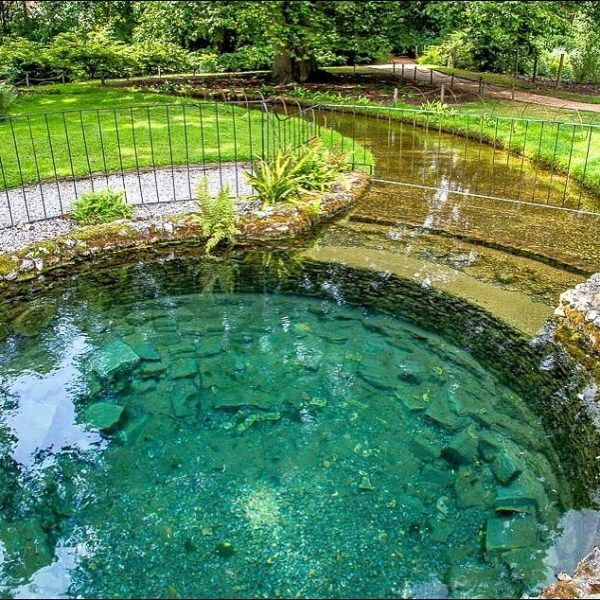
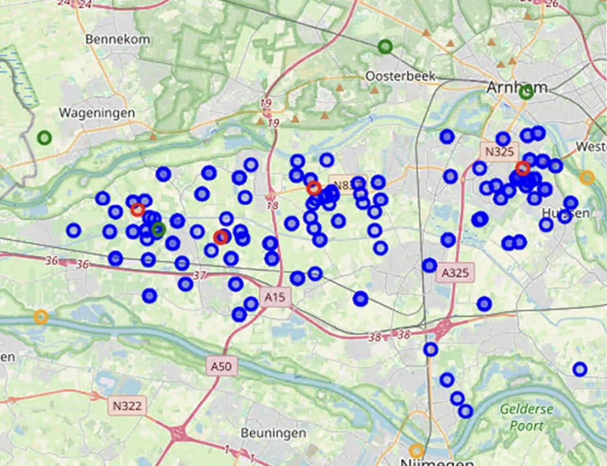
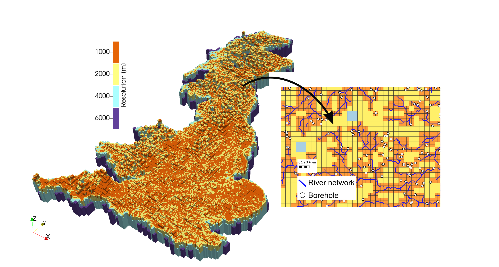
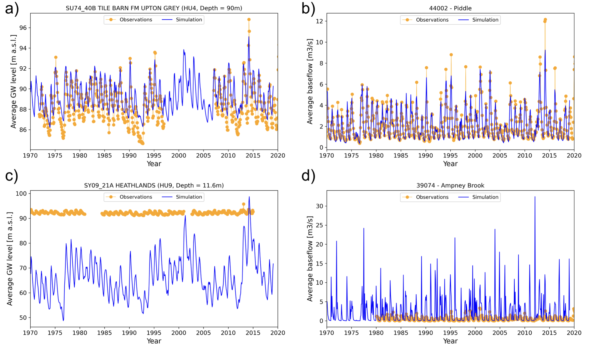
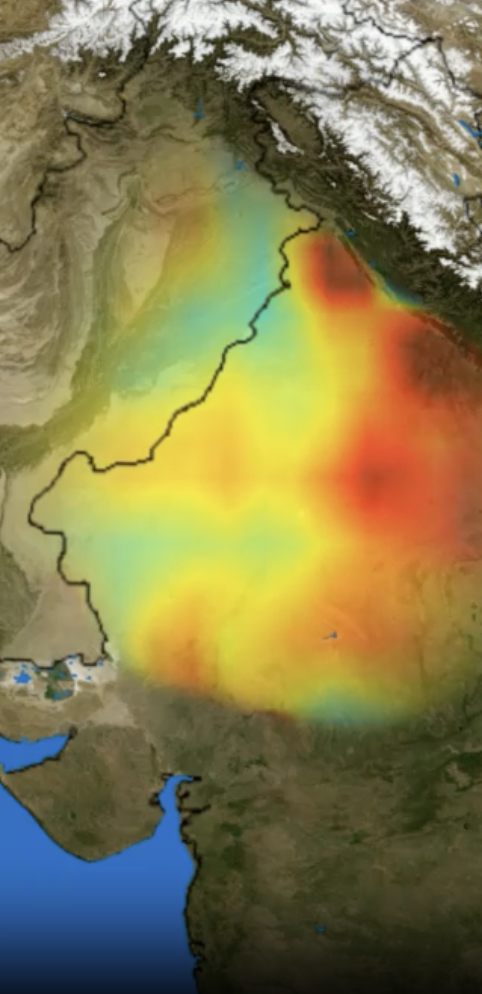

# National-Scale Groundwater Modelling

James Carlyle
4 December 2025
AI for Sustainability  PhD CDT

Image: https://x333xxx.wordpress.com/2016/03/26/

---
# Motivation
* Water is a fundamental resource for terrestrial wildlife and human society. Groundwater holds about 30% of the world’s freshwater, and worldwide, provides about 50% of drinking and 30% of irrigation water.
* I worked on a groundwater supply project in Nepal in 1986; poor water quality was leading to a 25% mortality rate for children.
* Recent climate change has led to greater variability in rainfall, leading to heatwaves and drought, as well as saturation and flooding. Population growth and rising living standards have increased extraction.
* IPCC: groundwater extract may account for 15% of global sea-level rise.
* Groundwater is hard to predict - it depends on complex variables (rain, evaporation, extraction) as well as uncertainties (aquifer geology, features).

Images: https://globalpressjournal.com/asia/nepal/water-sources-run-dry-nepal-2015-earthquake-forcing-people-leave-ancestral-villages-hike-faraway-wells/

---
# What is Groundwater?

Image: https://upload.wikimedia.org/wikipedia/commons/thumb/c/c7/Groundwater_flow.svg/1200px-Groundwater_flow.svg.png

---
# Previous work with Machine Learning (ML)
Since 2020, **single systems (aquifers)** have been modelled with ML. Recent examples include:
  * Hybrid and attention-based models (e.g. CNN-LSTM)
  * Spatial-Temporal Graph Neural Networks (ST-GNN)
  * Physics-Informed Neural Networks (PINNs)

ML models have shown continued improvement, showing higher accuracy and lower inference computational requirements
  
Image: https://encrypted-tbn0.gstatic.com/images?q=tbn:ANd9GcTXkPBTTW11kp7SWbp_ztnP_Jwl2hpGNyYpEQ&s, 

---
# National Scale Modelling
* At national scale, groundwater is modelled physically.
* The global standard software is MODFLOW, a 40 year-old finite-difference model written in Fortran.
* In the UK, the British Groundwater Model (BGWM) has been developed since 2020, based on MODFLOW.

 

Images: https://www.bgs.ac.uk/geology-projects/environmental-modelling/british-groundwater-model/

---
# National Scale Limitations
* At national scale, models are inaccurate and require extensive computational facilities, which limit resolution and generation frequency of predictions.
* These graphs demonstrate significant discrepancy between prediction and observation. 
  

* Recent advances in ML methods have not been applied at national scale.
Images: https://www.bgs.ac.uk/geology-projects/environmental-modelling/british-groundwater-model/ ,https://doi.org/10.1080/02626667.2024.2320847

---
# Research Question
<big>What ML techniques can improve on the prediction accuracy of the physical finite-difference models currently used for  groundwater levels at national scale?</big>

## Methodology
* Assess the architecture and interface for the current MODFLOW implementation of BGWM.
* Work with a limited time and spatial subset of the underlying datasets (groundwater levels and geology).
* Determine 3 high-performing ML approaches, determined from results in literature review.
* Apply ML approaches to BGWM subset and evaluate the model and parameters with highest predictive accuracy.
* Evaluate against MODFLOW prediction.
* Apply chosen model at national scale.
* Re-evaluate, noting and addressing scaling issues.

---
## Research Sub-question 1
<big>What is the best resolution available using appropriately pre-trained ML inference for national-scale groundwater prediction using desktop hardware?</big>

* What is the trade-off between granularity / resolution and computational resource needed when inferencing with an established ML model? 
* Is it possible to make simulation runs available to scientists with lower-powered computers?

## Research Sub-question 2
<big>How should a ML groundwater prediction model trained using extensive data be modified to continue to perform in a region with little data? </big>
* Challenges exist in countries with rapidly expanding populations and rising living standards (e.g. north India, where levels are dropping 30cm/year), but with less historical / geological data. 
* How can ML models be adapted so that they function well in data-constrained regions?

Images: https://svs.gsfc.nasa.gov/3623/
---
## Proposed supervisory team members 
This topic has been discussed in person with:
* Professor Justin Sheffield
* Professor Paul Kemp
* Professor Jadu Dash

## SustAI CDT theme alignment
This topic has been discussed in person with:
Professor Lindsay-Marie Armstrong, theme lead for "AI for the Natural Environment"

James Carlyle
james.carlyle@soton.ac.uk
SustAI CDT
School of Electronics and Computer Science
University of Southampton