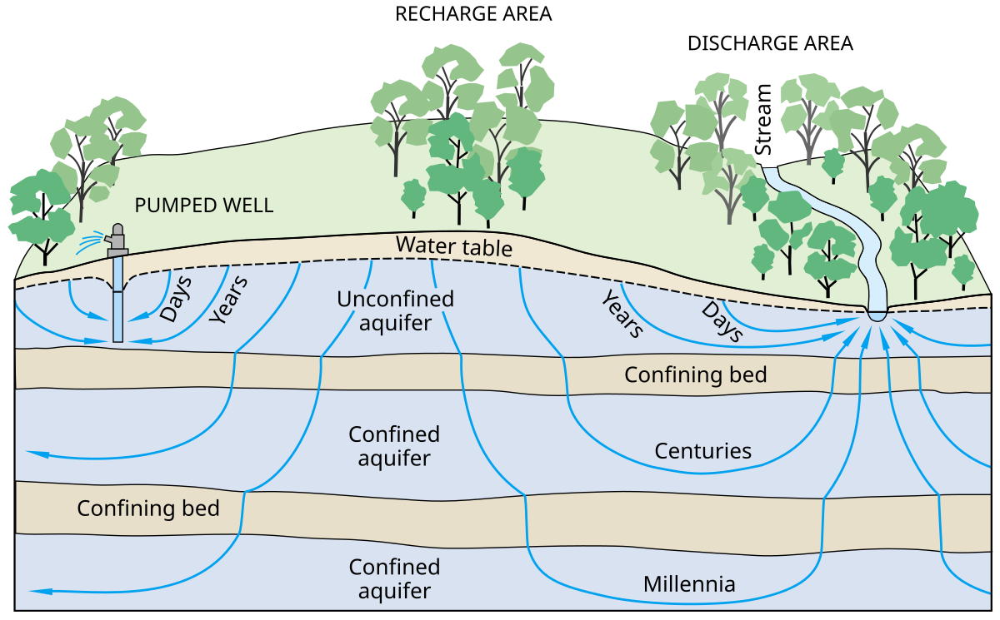
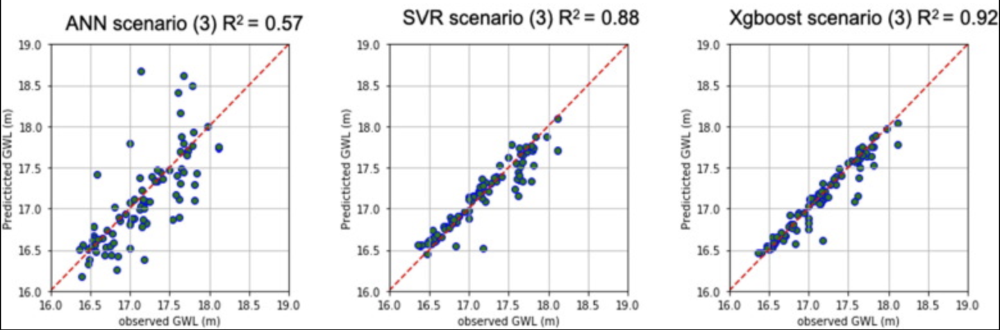

# Improving Groundwater Behaviour Prediction with AI

James Carlyle
18 November 2025
AI for Sustainability PhD CDT

## Abstract

## Introduction

Water is a fundamental resource for terrestial wildlife and human society. It is essential for all agriculture, and can have a huge impact on human health. As a student, I worked in Nepal on a groundwater supply project in 1986, where poor water quality let to a 45% mortality rate for children below the age of 5 through water-bourne diseases, such as amoebic dysentry. Although clean water provision around the world has improved since then, it remains a critical enabler of good health, and growing populations and a drive for higher living standards continue to put groundwater systems at risk.

Groundwater has traditionally been modelled by heuristic-based software, based on limited understanding of the heterogenous geology of the area. This leads to inaccuracy and unsustainable water extraction (abstraction).

Machine learning offers a compelling alternative that addresses these fundamental limitations. Unlike physics-based models, data-driven machine learning approaches can identify complex patterns and nonlinear relationships using only relevant variables, without requiring explicit parameterization of underlying hydrogeology processes. 

This position paper argues that machine learning represents an opportunity to improve groundwater prediction capability, particularly given the growing pressures of climate change, population growth, and abstraction demands on water resources. By benefiting from the pattern-recognition capabilities and computational efficiency of modern machine learning, hydrogeologists  can deliver more accurate, scalable, and responsive groundwater predictions.

## Background
Water is abstracted from the ground, from rivers and lakes, and in arid climates from seawater through reverse osmosis. Groundwater has several major advantages - the ground provides a natural reservoir, and reduces contaminants such as suspended solids, organic matter, and pathogens, resulting in up to 31% less energy processing to reach drinking quality [[3]]. Groundwater supplies nearly half of the world's drinking water​ [[4]], and depending on climate, groundwater provides 33-59% (Europe, North America) of water for agriculture [[5], [6]]

Global groundwater extraction doubled between 1960-2000​ [[7]], with aquifer depletion exceeding 50 metres in critical regions​. Satellites such as GRACE-FO have shown that significant groundwater depletion is happening in countries like India, where 17 KM^3 has been lost in a single year [[8]]. Analysis by IPCC suggests that groundwater removal may account for 15% of global sealevel rise [[9]], because 80% of extracted groundwater remains in the oceans [[10]].

Here in the UK, the complaint is that it rains too much. But even here, because of an increase in the intensity of rainfall, with rain exceeding 20mm/hr occuring 4 times more often by 2070 [11], and a reduced ability of parched and compacted ground to adsorb rain, groundwater is getting replenished more slowly. As a result, up to 15% of England experienced freshwater usage restrictions in 2025 [[12]], even in November 2025. 

Meta-analyses show infiltration rates can halve under bare or compacted rather than vegetated soils, directly linking hydrophobicity to lower water absorption rates in dry soils [[13]]. The impacts of drought last much longer than the drought itself, and ironically increase the probability of future drought. Meanwhile, sporadic rainfall which isn't adsorbed into the surface causes flooding damage and the run-off overwhelms sewage systems, causing 450,000 sewage discharges in 2024 [[14]] and leading to further environmental damage as rivers and coasts are polluted.

Changes in flow regimes caused by abstraction affect river ecological indicators including invertebrate diversity, algae, bacteria, and other microorganism growth, fish biomass, and overall ecosystem health. For example, abstraction tends to increase algae biomass while reducing invertebrate richness and organic matter decomposition [[15]].

Effective management of groundwater resources requires predictive capacity. Yet groundwater systems present inherently complex prediction problems, as they are influenced by numerous interacting factors from meteorological variables (precipitation, temperature, evaporation) to human activities (such as abstraction and land use changes). Groundwater is difficult to model geologically since aquifers contain unknown geological discontinuities. Identifying hydrogeological and physical properties is complex because it necessitates detailed subsurface data, such as borehole information, which is often difficult to obtain comprehensively [[16]].

Traditional physically-based computational models such as MODFLOW, while rigorous, demand extensive calibration and detailed knowledge of local conditions [[17]], creating bottlenecks in areas where data are sparse or resources limited. Additionally, these conventional approaches often struggle to model the nonlinear, non-stationary characteristics of real-world groundwater systems effectively - outputs are calculated from long-established heuristics and a small number of input parameters, rather than being trained by observed inputs and outputs [[18]].​

Recent advances in deep learning architectures, including convolutional neural networks (CNNs), recurrent neural networks (RNNs), and spatial-temporal graph neural networks (ST-GNNs), and these have demonstrated superior predictive accuracy compared to both traditional shallow networks and conventional numerical methods [[19]]. 

Critically, machine learning techniques show particular promise in sparse data scenarios, handling missing values, and capturing the complex spatial-temporal dependencies that characterize interconnected groundwater systems [[20]].​ For example, there is often a lag between rainfall and groundwater change, as different groundwater systems percolate at different rates.

### Literature Review
This review classifies work to date by technology approach. The following diagram illustrates the development of methods and techniques used over the last 20 years, from statistical, early neural network and shallow / classical machine learning to more recent deep learning approaches.

#### Classical Machine Learning Approaches
Classical approaches supported prediction of groundwater levels after rainfall though the development and fitting of fine-grained decision trees, leading to a degree of interpretability.

**Support Vector Machines (SVM)**
Support vector machines emerged as a powerful alternative to neural networks in the early 2000s. Yoon et al. (2011) [[23]] conducted a comparative study demonstrating that SVMs outperformed traditional NNs for predicting groundwater levels in coastal aquifers. The technique excels at handling non-linear relationships by mapping inputs to higher-dimensional spaces using kernel functions, particularly the radial basis function (RBF) kernel.​ 

**Random Forest (RF)**
Random forest algorithms have become widely adopted for groundwater modeling due to their ensemble approach and ability to handle high-dimensional datasets while mitigating overfitting. The method constructs multiple random decision trees using bootstrap sampling and aggregates their predictions with voting to improve robustness.​ The original paper by Breiman (2001) [[25]] was considered transformational, and more recently RF have been demonstrated to support effective spatial prediction [[26]].

**Ensemble Learning: XGBoost, CatBoost, and Gradient Boosting**
Modern ensemble boosting methods have demonstrated exceptional performance in groundwater applications. Chen and Guestrin (2016) developed XGBoost, which uses regularized model formalization to control overfitting [[27]]. XGBoost has shown superior predictive capability in multiple comparative studies [[28]].​ A comprehensive study of six ensemble learning models (RF, AdaBoost, XGBoost, CatBoost, GBDT, and LightGBM) identified XGBoost as having superior performance in groundwater potential mapping [[29]].​

#### Neural Network Approaches
Neural network approaches model groundwater aquifers using a black-box approach to deep learning, with borehole data providing inputs to hidden layers.

**Early Artificial Neural Networks (1990s-2000s)**
The application of ANNs in groundwater modeling gained prominence in the early 1990s [[30]]. Maier and Dandy (2000) published a seminal review that became one of the most influential papers in the field[[31]], establishing fundamental guidelines for developing neural network models for water resource variables. This comprehensive review outlined essential development stages including performance criteria selection, data division and preprocessing, input variable determination, network architecture design, and model validation.​

Coulibaly et al. (2001) calibrated three types of ANN models using groundwater level and hydrometeorological data, establishing early benchmarks for model performance [[32]]. Lallahem et al. (2005) evaluated neural networks for groundwater level estimation in fractured media, publishing influential work in the Journal of Hydrology [[33]]. Their research demonstrated that ANNs with appropriate architecture could effectively model groundwater systems with R² values approaching 0.95.​

Nayak et al. (2006) conducted groundwater level forecasting in shallow aquifers using ANN approaches, comparing multiple backpropagation algorithms. The Levenberg-Marquardt algorithm emerged as the best performer, showing superior results with minimum deviation values mostly within ±0.5 meters and acceptable prediction accuracy exceeding 94.52% [[34]].​

**Long Short-Term Memory (LSTM) Networks**
The introduction of LSTM networks to hydrology marked a paradigm shift in data-driven modeling. Kratzert et al. (2018) [[35]] published a landmark paper applying LSTM networks to rainfall-runoff modeling across 241 catchments. This study demonstrated that LSTMs could learn long-term dependencies essential for modeling storage effects in catchments, outperforming the well-known Sacramento Soil Moisture Accounting Model (SAC-SMA). The work has been highly cited and established LSTMs as a viable alternative to traditional hydrological models.​

Zhang et al. (2018) [[36]] developed an LSTM-based model for predicting water table depth in agricultural areas, achieving remarkable accuracy. The LSTM model demonstrated R² scores ranging from 0.789 to 0.952, substantially outperforming traditional feed-forward neural networks. This work showed that dropout methods effectively prevented overfitting and that LSTM architecture possessed strong learning ability for time series groundwater data.​

Solgi et al. (2021) [[37]] demonstrated that LSTM networks could predict groundwater levels with exceptional accuracy: R² of at least 99.89% for one-cycle predictions and 90.00% for 26-cycle ahead predictions over 17 years of data. The study confirmed LSTM's superiority over feed-forward neural networks in both point prediction and prediction interval tasks.​

**Convolutional Neural Networks (CNN)**
Seo and Lee (2021) [[38]] advanced groundwater modeling by developing CNN-LSTM hybrid architectures, combining CNN's spatial feature extraction with LSTM's temporal dependency handling. The CLSTM model produced more accurate groundwater simulations than standalone CNN or LSTM models and proved particularly effective and that the use of parameters recorded by GRACE-FO (gravity detection) satellites as training data for deep learning models can play an important role in the model’s performance.​

**Recent Advances: Physics-Informed and Graph Neural Networks**
Goswami et al. (2021) [[39]] introduced DeepONet (deep operator networks) to groundwater modeling, demonstrating that AI-based approaches could successfully address the complexities of simulating subsurface flows. DeepONet uses two deep neural networks (branch and trunk) to learn mappings between infinite-dimensional function spaces.​

Taccari et al. (2024) [[40]] pioneered the application of spatial-temporal graph neural networks (ST-GNNs) to groundwater level prediction. This innovative approach addresses the limitation of previous neural network methods that predominantly focused on temporal dynamics while overlooking spatial relationships. The ST-GNN model showed significant improvements over traditional methods, particularly for handling missing data and long-term forecasting with minimal bias. The graph-based framework facilitates integration of physical borehole interconnectivity and temporal aspects, capturing complex interactions within groundwater systems over distance and time.​

#### Conclusions
Deep learning models generally excel with larger datasets, while classical ML and shallow neural networks perform better with limited training data. Hybrid approaches incorporating wavelet decomposition, ensemble methods, or data assimilation consistently outperform standalone models.​

The evolution of AI and ML in groundwater modeling reflects broader trends in computational hydrology. Early ANN applications in the 1990s-2000s established feasibility and identified key modeling considerations. The introduction of SVMs and ensemble methods in the 2000s-2010s provided robust alternatives with strong theoretical foundations. The deep learning revolution beginning around 2016-2018, particularly LSTM networks for sequential data, transformed the field by enabling unprecedented accuracy and the ability to learn long-term dependencies automatically.​

Recent innovations—including CNN-LSTM hybrids, physics-informed neural operators (PINNs), and graph neural networks—represent the cutting edge, addressing limitations of purely data-driven approaches through integration of spatial context, physical constraints, and operator learning frameworks. The field continues to evolve toward hybrid physics-AI systems that balance interpretability with predictive power, offering promising directions for sustainable groundwater management under increasing uncertainty.​

Group papers into different categories of approaches. Visualise differences and commonalities between groups using,
e.g., graphs, tables, figures.
• For each group, provide a concise summary of the underpinning concept.
• Highlight key papers in each group, e.g., papers that changed how people think about the problem.
• What makes these papers stand out?
• Provide an objective discussion of the benefits and disadvantages of each approach:
• Consider aspects such as performance of the algorithm regarding evaluation metrics common in the related work, computational
cost, and resilience against uncertainties.
• What types of data was the work tested on?
• Do you foresee challenges when applying the work to data that is specific to your problem?
• Is the approach feasible in practice? What aspects of the problem can and cannot be addressed?
• What sort of date they used? What data do researchers in the field normally use?

### Synthesis:
• What has the state-of-the-art achieved?
• What are the outstanding challenges?

The state-of-the-art has achieved a high degree of accuracy of prediction of groundwater level behaviour. The following series of graphs of the measure of error R² show the improvement even within classical ML approaches, and more recent hybrid approaches are seeing R² approach values of 0.99.

***Outstanding Challenges***
One of the most fundamental limitations is insufficient training data, particularly in many regions of the world. Groundwater domains typically lack extensive, labeled datasets compared to domains like computer vision or natural language processing. Long-term historical data—ideally 10 or more years—is essential for reliable groundwater level (GWL) forecasting, yet such comprehensive records are rarely available. This scarcity is particularly acute in developing countries where monitoring infrastructure remains limited or unreliable.

Another unresolved challenge is to build an AI-powered model at a national scale. The UK is probably unique in having more mature geological and hydrogeological mapping than any other country, and I think it's possible to build a groundwater model using a Physically Informed Neural Network using a 3D gridded map of the geology of the UK, including groundwater-supporting features, as the basis for a model for groundwater behaviour at 1KM resolution across the entire country.

The Hydro-JULES research programme is developing a new generation of terrestrial hydrological models in collaboration with the Joint UK Land Environment Simulator (JULES) model. One of the major outputs is the British Groundwater Model (BGWM), the first integrated groundwater model covering Great Britain to simulate transient groundwater dynamics and surface water/groundwater interactions at the national scale.

Through the development of new models that better simulate the movement of water, both vertically and laterally, advances in land surface–boundary layer science can be made. Two scales are being considered for the application of the modelling approach: the British mainland (England, Scotland and Wales, including major islands) and the global scale.

Questions under consideration at the British mainland scale are:

How can an integrated approach improve the simulation of major flooding events such as the 2013–14 floods?
How can a holistic approach be undertaken to assess water resources under drought conditions?

### Research Questions
Bold and explicit: The main questions that you are aiming to address
• [For a PhD thesis, you would usually] identify 3-4 sub-questions and map them to techniques
you see fit for addressing them [justify using literature]
• It is recommended that you follow the “FINER” framework to ensure that research questions
are Feasible, Interesting, Novel, Ethical, and Relevant (FINER)
• Research questions should be well formulated. For example, the PICO framework may help
you to construct your research questions by identifying the Problem, Issue / Improvement,
Comparison, and targeted Outcome (PICO).
• As a rule-of-thumb, for a PhD, each objective should correspond to one thesis chapter. Each
thesis chapter corresponds to a journal article / high-impact conference paper
• Elaborate on each RQ. Do not just list a few bullet points.

## Concluding Remarks
This is not just to repeat and summarise
• Potential impact
• Ethical considerations
• Limitations
• Future Work

## References

\bibitem{$1} Jomaa. I. (2025). Other Drivers of Climate Change Groundwater Water Depletion. J Geol Min, 2(2), 01-09.
\bibitem{$1} Mo, Weiwei et al. Embodied energy comparison of surface water and groundwater supply options. Water research vol. 45,17 (2011): 5577-86. https://doi.org/10.1016/j.watres.2011.08.016
\bibitem{$1} Hai Tao et al. (2022) Groundwater level prediction using machine learning models: A comprehensive review. Neurocomputing Volume 489, 7 June 2022, Pages 271-308
\bibitem{$1} UN World Water Development Report 2022
\bibitem{$1} Water abstraction by source and economic sector in Europe, European Environment Agency, 2024. https://www.eea.europa.eu/en/analysis/indicators/water-abstraction-by-source-and
\bibitem{$1} Dalin, C., Wada, Y., Kastner, T. et al. Groundwater depletion embedded in international food trade. Nature 543, 700–704 (2017). https://doi.org/10.1038/nature21403
\bibitem{$1} The Gravity Recovery and Climate Experiment Follow-on (GRACE-FO): Tracking groundwater changes around the world. https://grace.jpl.nasa.gov/applications/groundwater/
\bibitem{$1}  Yoshihide Wada et al., Fate of water pumped from underground and
contributions to sea-level rise. https://pure.iiasa.ac.at/id/eprint/13009/1/Fate%20of%20water%20pumped%20from%20underground%20and.pdf
\bibitem{$1}  Kendon, E.J. et al. Variability conceals emerging trend in 100yr projections of UK local hourly rainfall extremes. Nat Commun 14, 1133 (2023). https://doi.org/10.1038/s41467-023-36499-9
\bibitem{$1}  Maryam Zakir-Hussain. Why hosepipe bans across Britain could continue into the winter. https://www.independent.co.uk/bulletin/news/hosepipe-ban-drought-winter-environment-agency-met-office-b2865672.html
\bibitem{$1}  Reinsch, S. et al. A.M. Temperate Soils Exposed to Drought—Key Processes, Impacts, Indicators, and Unknowns. Land 2024, 13, 1759. https://doi.org/10.3390/land13111759
\bibitem{$1}  Unpacking the 2024 Annual Sewage Spill Data, Rivers Trust. https://theriverstrust.org/about-us/news/2024-sewage-spill-cso-data
\bibitem{$1}  David C. Bradley, Daniel Cadman and Nigel J. Milner. Ecological indicators of the effects of abstraction and flow regulation. https://www.wfduk.org/sites/default/files/Media/Assessing%20the%20status%20of%20the%20water%20environment/WFD21D%20Final%20Report_30%2008%2012.pdf
\bibitem{$1}  Condon, L. E. et al. (2021). Global groundwater modeling and monitoring: Opportunities and challenges. Water Resources Research, 57, e2020WR029500. https://doi.org/10.1029/2020WR029500
\bibitem{$1}  Hill, M. C., & Tiedeman, C. R. (2007). Effective Groundwater Model Calibration: With Analysis of Data, Sensitivities, Predictions, and Uncertainty. John Wiley.
\bibitem{$1}  Juan S. Acero Triana, Maria L. Chu et al. Beyond model metrics: The perils of calibrating hydrologic models, https://doi.org/10.1016/j.jhydrol.2019.124032
\bibitem{$1}  Elsheikh, A. H. et al. (2022). Groundwater level prediction using machine learning models: A comprehensive review. Neurocomputing, 489, 271–308. https://doi.org/10.1016/j.neucom.2022.02.034
\bibitem{$1} Shu, L., Ji, Y., Wang, X., & Zhan, D. (2025). Missing Data Handling: A Comprehensive Review, Taxonomy, and Future Directions. Scientific Programming, 2025, Article ID 1234567. 

\bibitem{$1} Heesung Yoon et al. A comparative study of artificial neural networks and support vector machines for predicting groundwater levels in a coastal aquifer. Journal of Hydrology Volume 396, Issues 1–2, 5 January 2011, Pages 128-138.  https://agris.fao.org/search/en/providers/122535/records/65deac254c5aef494fdd2713
\bibitem{$1} T Sai Lahari, Mr. G. Suneel. Predicting Groundwater Levels: A Machine Learning Approach with Support Vector Regression. International Journal of Research Publication and Reviews, Vol 5, no 11, pp 3869-3877 November 2024, https://ijrpr.com/uploads/V5ISSUE11/IJRPR35153.pdf
\bibitem{$1} Breiman, L. Random Forests. Machine Learning 45, 5–32 (2001). https://doi.org/10.1023/A:1010933404324
\bibitem{$1} Rohde, M. M., et al. (2021). A Machine Learning Approach to Predict Groundwater Depth Beneath Groundwater-Dependent Ecosystems Across California. Frontiers in Environmental Science, 9, 738279.
\bibitem{$1} Chen, Tianqi, and Carlos Guestrin. XGBoost: A Scalable Tree Boosting System. Proceedings of the 22nd ACM SIGKDD International Conference on Knowledge Discovery and Data Mining (KDD), 2016. https://dl.acm.org/doi/10.1145/2939672.2939785
\bibitem{$1} Xiong, H.et al. (2023). Spatial prediction of groundwater potential by various novel boosting-based ensemble learning models in mountainous areas. Geocarto International, 38(1). https://doi.org/10.1080/10106049.2023.2274870
\bibitem{$1} Mohammed Sakib Uddin et al. An ensemble machine learning approach for predicting groundwater storage for sustainable management of water resources, Groundwater for Sustainable Development, Volume 29, 2025, https://doi.org/10.1016/j.gsd.2025.101417.
\bibitem{$1} Holger R. Maier, Graeme C. Dandy. 1996. The Use of Artificial Neural Networks for the Prediction of Water Quality Parameters. https://doi.org/10.1029/96WR03529
\bibitem{$1} Holger R. Maier, Graeme C. Dandy,. Neural networks for the prediction and forecasting of water resources variables: a review of modelling issues and applications, Environmental Modelling & Software, Volume 15, Issue 1, 2000, https://doi.org/10.1016/S1364-8152(99)00007-9.
\bibitem{$1} Paulin Coulibaly, Bernard Bobée, François Anctil. Hydrological Processes. Volume15, Issue8 15 June 2001. Improving extreme hydrologic events forecasting using a new criterion for artificial neural network selection. https://doi.org/10.1002/hyp.445
\bibitem{$1} S. Lallahem, et al. On the use of neural networks to evaluate groundwater levels in fractured media, Journal of Hydrology,Volume 307, Issues 1–4, 2005, https://doi.org/10.1016/j.jhydrol.2004.10.005.
\bibitem{$1} Nayak, Purna C., YR Satyaji Rao, and K. P. Sudheer. "Groundwater level forecasting in a shallow aquifer using artificial neural network approach." Water resources management 20.1 (2006): 77-90.
\bibitem{$1} Kratzert, Frederik et al. (2018). Rainfall–runoff modelling using Long Short-Term Memory (LSTM) networks. Hydrology and Earth System Sciences. 22. 6005-6022. https://doi.org/10.5194/hess-22-6005-2018
\bibitem{$1} Jianfeng Zhang et al. (2018) Journal of Hydrology Volume 561, June 2018, Pages 918-929 Developing a Long Short-Term Memory (LSTM) based model for predicting water table depth in agricultural areas https://atmos.eoas.fsu.edu/~mye/pdf/paper85.pdf
\bibitem{$1} Ryan Solgi et al. (2021) Long short-term memory neural network (LSTM-NN) for aquifer level time series forecasting using in-situ piezometric observations, Journal of Hydrology,Volume 601,2021, https://doi.org/10.1016/j.jhydrol.2021.126800.
\bibitem{$1} J. Y. Seo and S. -I. Lee, Predicting Changes in Spatiotemporal Groundwater Storage Through the Integration of Multi-Satellite Data and Deep Learning Models, in IEEE Access, vol. 9, 2021, doi: 10.1109/ACCESS.2021.3130306.
\bibitem{$1} Maria Luisa Taccari, He Wang, Somdatta Goswami et al. Developing a cost-effective emulator for groundwater flow modeling using deep neural operators, Journal of Hydrology, https://doi.org/10.1016/j.jhydrol.2023.130551.
\bibitem{$1} Taccari, Maria & Wang, He & Nuttall, Jonathan & Chen, Xiaohui & Jimack, Peter. (2024). Spatial-Temporal Graph Neural Networks for Groundwater Data. 10.21203/rs.3.rs-4009213/v1. 
\bibitem{$1} Samuel K. Afful et al. (2025) A systematic review of neural network applications for groundwater level prediction. https://nora.nerc.ac.uk/id/eprint/540185/1/N540185JA.pdf
