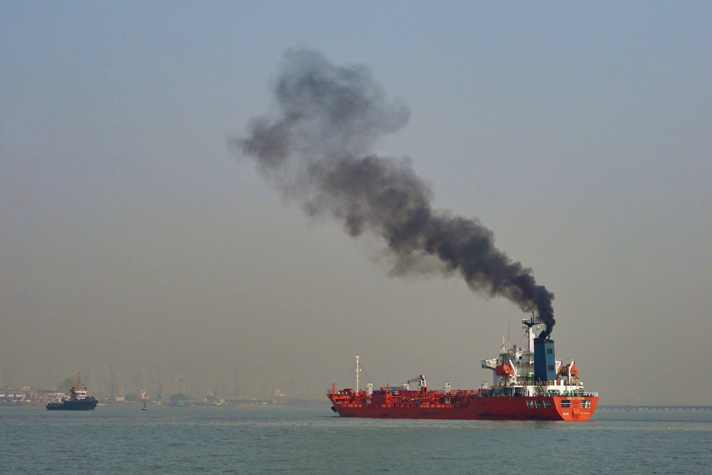
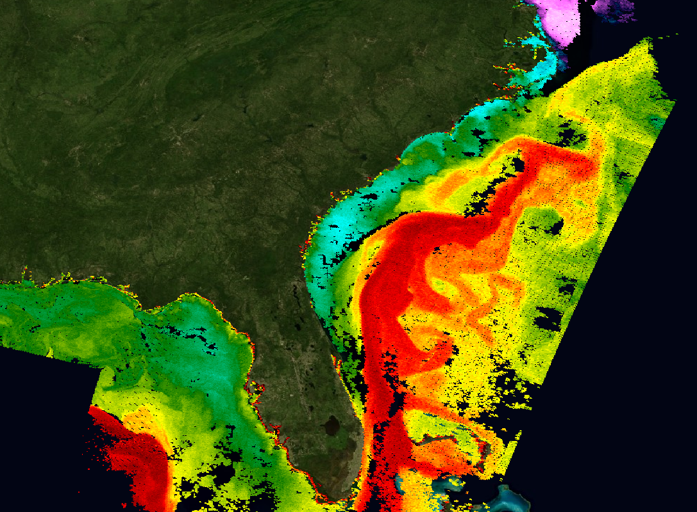

#  AI for Sustainable Ship Operations
# Research Questions
James Carlyle
1 November 2025
SUST6002

---
## The Challenge

Sea levels are rising and putting millions of people at risk.

Shipping carries **80%+ of global cargo** $_{3}$; we can't live without it.

Shipping accounts for up to 1B Kg CO$_{2}$/year, 3% of greenhouse gas emissions globally. $_{1,2}$

This is an increase of 20% over the decade (International Maritime Organisation). $_{3}$

---
Perhaps reorder slides as
1. Problem statement summary
2. Problem - detail - existing research
3. Goal, leading to
4. Research question - main
5. Research questino - subsidiary
6. Methodology
7. Thank-you

NB. References as slide foot-notes
Method not in RQ itself
Consistent language, no AI-gen slop

---

## The Opportunity
* Operational controls, including speed / trim adjustment and route optimisation are the **most cost-effective solutions**.
* These tactics depend on **accurate Ship Fuel Consumption (SFC) predictions**.
* A **ship-specific** (heterogenous), causal framework could lower carbon emissions by 10%.

## Motivating Question
**How can we build explainable AI to guide captains' decisions?**

---

### The Homogeneity Assumption
Current   models treat ships as a **single homogeneous system**, ignoring real life diversity such as sea conditions, port operations, ship design, age, and hull condition (biofouling).

### The Explicability Problem
Advanced ML models achieve accuracy but reveal **correlations, not causes**. Captains use experience and instinct in the absence of explanation. Ship safety regulations require decision justifications.

---

## Research Questions
**RQ1**: How can the intrinsic heterogeneity of ship operational states be systematically identified, modelled, and interpreted to develop more accurate and robust SFC prediction frameworks?

**RQ2**: How can we move beyond correlation to establish the true causal relationships between key operational, navigational, and environmental factors and SFC to inform ship captains, owners and IMO regulations?

---
### Research Goal

Develop an **AI-powered, interpretable, and causally informed framework** for ship fuel consumption prediction that is: **accurate** (robust predictions across diverse operational conditions), **interpretable** (a clear understanding of causal mechanisms), and **applicable** (trustworthy, actionable insights for captains and owners).

### Why It Matters
**Industry adoption** of trustworthy systems that operators will actually use, leading to an **environmental impact** of reduced shipping carbon emissions.

---

# Thank you
James Carlyle
james.carlyle@soton.ac.uk
SustAI CDT
School of Electronics and Computer Science
University of Southampton

---
# References
1. IMO, Fourth Greenhouse Gas Study [link](https://www.imo.org/en/OurWork/Environment/Pages/Fourth-IMO-Greenhouse-Gas-Study-2020.aspx)
2. A review on carbon emissions of global shipping [link](https://link.springer.com/article/10.1007/s44312-023-00001-2)
3. UNCTAD’s Review of Maritime Transport 2023 [link](https://unctad.org/publication/review-maritime-transport-2023)
4. Fan, A. et al, 2025. Multi-dimensional performance...under dynamic operating conditions. Energy 332, 137120. [link](https://doi.org/10.1016/j.energy.2025.137120)
5. Wang et al, 2023. ... tradeoff between interpretability and accuracy...Emerging Technologies 157, 104361. [link](https://doi.org/10.1016/j.trc.2023.104361)
6. Yan, R et al, 2024. Improving ship energy efficiency: Models, methods, and applications. Applied Energy 368, 123132. [link](https://doi.org/10.1016/j.apenergy.2024.123132)